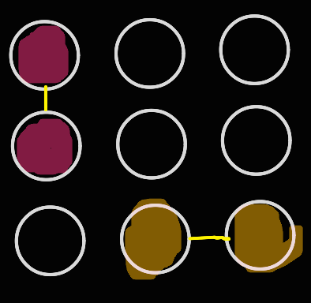

## 1. 연결된 컴포넌트
> 그래프에서 간선으로 연결된 정점들의 집합으로 이루어진 하위 그래프입니다.

## 2. 예시  
[1 0 0]   
[1 0 0]   
[0 1 1]   

이 경우 컴포넌트는 총 2개고 각각의 컴포넌트는 2개의 정점을 가집니다.
그리고 컴포넌트들을 번호 붙여가며 묶는 알고리즘을 "Flood Fill"이라고 합니다.

</img> 