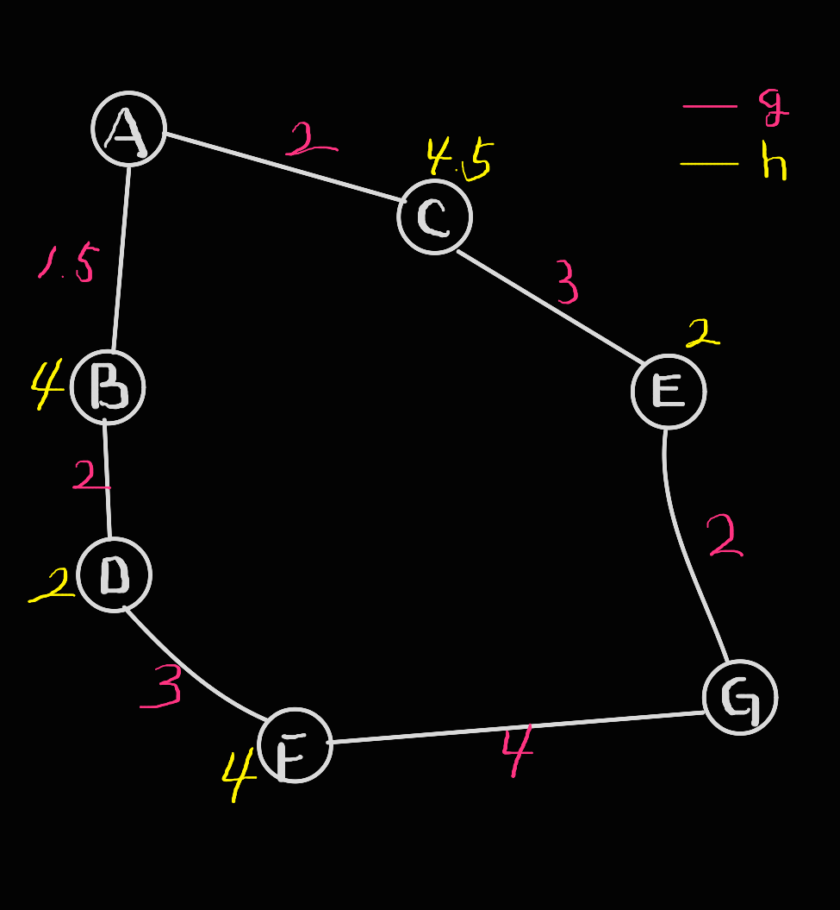

# 1. A*알고리즘이란
> - 로봇의 인공지능 개발의 일환으로 목적지까지 장애물을 피해 경로를 탐색하는 방법을 고안.
> - 다익스트라 알고리즘의 확장버전이라고 보면됨.

### - (다익스트라 알고리즘)
- 그래프의 모든 경로를 탐색하고 최적의 경로를 계산
- 목적지까지 거리 합을 비교해 최단 경로를 도출(경로값만 고려)
- 결과는 정확하지만 그래프가 복잡해지면 메모리와 계산 양이 많이 늘어남

> - 그에 비해 A* 알고리즘은 다익스트라 알고리즘에서 휴리스틱을 확용해 메모리 사용과 검색 속도를 개선
> - 휴리스틱은 경험적 지식을 활용해 답을 구하는 방법을 말함.
> - 간편하고 효율적이라 게임, 자동차 네비, 자연어 파싱 등에 두루 사용됨

# 2. 동작원리
- f(n) = g(n) + h(n) : 최종값 = 경로 값 + 휴리스틱 예측값
- 휴리스틱 설정은 일반적으로 목적지까지의 최단 거리로 설정   
 또는 상황에 따라 다양한 함수로 유연하게 설정

# 3. A* 계산 과정
</img> 
**1. A-B = 1.5 + 4, A-C = 2 + 4.5**  
A-B 경로가 더 작으므로 채택    
A-C 경로의 결과값은 기억해두고 이 값보다 더 큰 값이 나오면 다시 이 경로에서 계산을 시작한다.

**2. A-D = 1.5 + 2 + 2**  
여전히 A-C 경로(6.5)보다 작기 때문에 현재 경로에서 계속 계산한다.

**3. A-F = 1.5 + 2 + 3 + 4**  
A-C 경로(6.5)보다 크기 때문에 A-C 경로로 이동해 계산한다.
A-D 경로의 결과값은 기억해둔다.(=9)

**4. A-E = 2 + 3 + 2**  
A-D(9)의 경로보다 작기 때문에 현재 경로에 머문다.
다음 노드가 G이기 때문에 계산을 중단한다.

**5. 최종 경로는 A-C-E-G**

**6. 따라서**
- 다익스트라 알고리즘과 달리 F-G의 경로를 계산하지 않아도 문제를 해결할 수 있다.
- 메모리와 계산 양을 줄일 수 있어 실시간에 빠른 연산량을 요구하는 게임 콘텐츠에서 유용하게 사용될 수 있다.
---
---
---
---
## 기타. [A* 알고리즘 구현 예제(Unity)](https://github.com/JustDoYoung/Algorithm_Pathfinding)